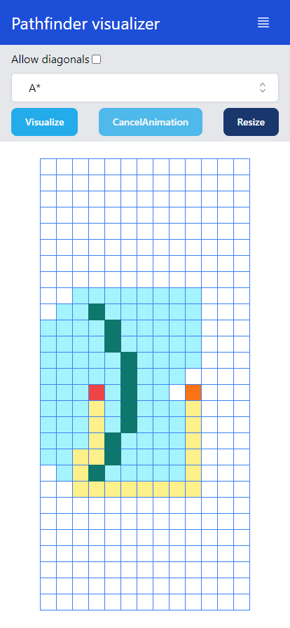

# PATHFINDING VISUALIZER

<p align="center">
  
  
</p>
<h1 align="center"><a href="https://aaronhernandezperez.github.io/pathfinding-visualizer/" target="_blank">Live demo</a></h1>

Pathfinder visualizer made with React, Redux and Tailwind.
It supports weighted and unweighted algorithms, as well as moving diagonally

## List of algorithms:

Weighted:

- A\*
- Dijkstra
- Greedy best-first search

Unweighted

- Breadth first search
- Depth first search

## How to run

For the dev server we are using Vite, to set it up run the following commands

```bash
npm i
npm run dev
```

## TODO

- Replace the grid rendering with a canvas, since updating individual dom nodes takes a lot of time and introduces lag
- Add clean grid button
- Add weighted nodes
- Add automatic mazes
- Show how much the algorithm took to get to the meta
- Add a list with all the times
- Add tests
